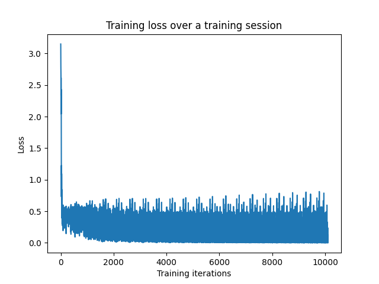
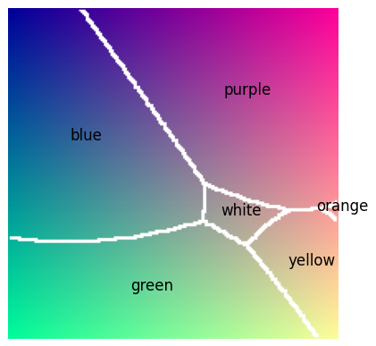

# Colour Recognizing Neural Network

This is a program that implements a feed-forward neural network to recognize colours by their RGB values.

I started on this project all the way back in 2018, but I didn't have the necessary math knowledge or skills to make it work successfully. Now, nearly 5 years later, I have made it work!

If you're interested, I also wrote [a blog post](https://callumoriley.ca/posts/neuralNetwork.html) about this project!

## Contents
- `main.py` has the actual network
- `backpropogation_example.ipynb` is a Jupyter Notebook that I used to test out computational methods for the neural network (based on [Matt Mazur's example](https://mattmazur.com/2015/03/17/a-step-by-step-backpropagation-example/))
- `interactive_network.ipynb` is another Jupyter Notebook that allows you to use the neural network in a more interactive way than through running it in a Python IDE or through the command line
- `classification_visualization.ipynb` is another Jupyter Notebook that shows a 2D plot of the separations between colour classifications (kind of like a regression)
- `ColourClassifier/ColourClassifier.pde` is a processing application that allows me to quickly generate a training data file
- `colours.txt` and `generate_colours.txt` are training data files with RGB values and colour names listed
    - `colours.txt` was the original file that I generated back in 2017
    - `colours_combined.txt` is a larger file that I generated more recently with the help of the Processing application ColourClassifier
- `weights.npz` is a file with the weights from a training session, so import those if you want to use a pre-trained model

## Dependencies

### Python scripts/Jupyter notebooks
- Python 3 (could probably run with lots of different versions, but I wrote it using 3.10)
- NumPy (again, probably has a wide range of versions that you could use, but I'm using 1.23)
- Matplotlib (same as above, I'm using 3.5)
- ipywidgets (for interactive Jupyter Notebook, I'm using 7.7)

### Processing program
- Processing (could probably use 3 or 4, but I used 4)

## Usage

- Running the main network: `python main.py`  
    - Make sure you set the properties in the program before running it  
- Running the Jupyter Notebooks: in a command prompt or terminal, `cd` into wherever this directory is downloaded and run `jupyter notebook`, then use the interactive web browser window to run the notebooks
- Running the Processing program: open `ColourClassifier.pde` in the Processing IDE (within its folder) and click the run button  
    - Make sure you set the properties in the program before running it  

## Properties in main.py

- `INPUT_NEURONS` - number of neurons in the input layer. Depends on what data format your input is
- `HIDDEN_NEURONS` - number of neurons in the hidden layer. The only real independent variable affecting how capable the network is. Should not be too low such that it can't complete the task and not to high such that it will remember the training data and overfit
- `OUTPUT_NEURONS` - number of neurons in the output layer. Depends on what data format your output is
- `TRAINING_FILE_NAME` - name of the file that you use for your training data
- `EPOCHS` - number of full pass-throughs of the training data the network will do during training
- `TRAIN` - boolean variable that says whether or not to train the network or just run the network with pre-existing weights
- `LEARNING_RATE` - set the learning rate of the network

## Evaluation

  

<em>Training loss over a training session, the network took about 10 seconds to generate this graph</em>

  

<em>Simulated regression plot of colour classification with the B channel held at 0.5 and the R and G channels being varied from 0 to 1 on each axis</em>

The network seems to work pretty well. The training loss ends up being quite low and when playing around with the Jupyter Notebook interface it seems to guess the colours quite accurately!